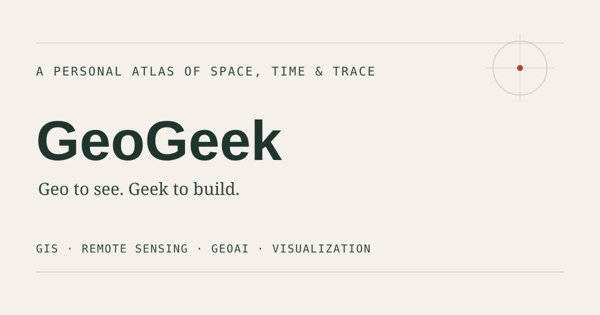

# GeoGeek

A personal lab for maps, field notes, and geospatial experiments.

**Geo to see. Geek to build.**

[](https://geogeeklab.github.io/)

https://geogeeklab.github.io/

## What's here

- **Field Notes** — notes on geography, GIS, remote sensing, and spatial thinking
- **Lab** — maps, tools, prototypes, and small geo experiments
- **Atlas** — spatial ways to browse the archive
- **Commons** — a shared geographic field built from approximate locations
- **Elsewhere** — places, references, and things that don't quite fit anywhere else

## Development

Requires Node.js.

```bash
npm run build
npm run qa
npm run preview
```

Build output goes to `dist/`. Don't edit it directly.

## Repository

```text
content/field-notes/   Field Note sources
site/                  Site UI and runtime
templates/             Page templates
scripts/               Build and QA tooling
backend/               Backend services
dist/                  Generated output
.github/workflows/      GitHub Pages deployment
```

See [`REPOSITORY.md`](REPOSITORY.md) for repository conventions.

## Build

The build validates content, generates static pages and archive data, runs QA, and writes the deployable site to `dist/`.

See [`STATIC_DELIVERY_ARCHITECTURE.md`](STATIC_DELIVERY_ARCHITECTURE.md) for the details.

## Deployment

Pushes to `main` are built and deployed to GitHub Pages with GitHub Actions.

## Third-party

Licenses and attribution live in [`site/THIRD_PARTY_LICENSES.md`](site/THIRD_PARTY_LICENSES.md).
