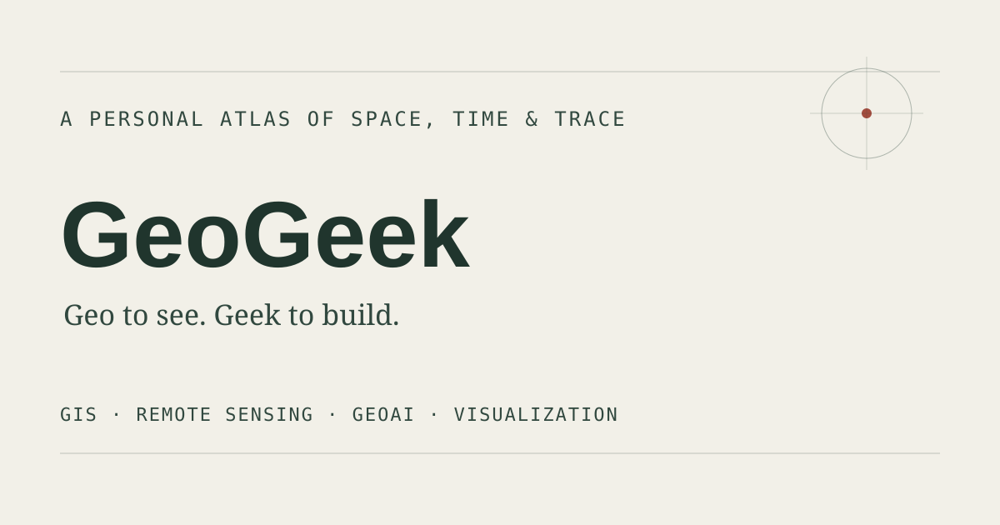

# GeoGeek

A geographic practice for observing, comparing, and building with space.

**Geo to see. Geek to build.**  
https://geogeeklab.github.io/

[](https://geogeeklab.github.io/)

GeoGeek does not treat a map as decoration. A map is an instrument with a field, a scale, a source, a relation, and a limit.

## Information field

The site uses a semantic information scale. The denominator describes information depth, not cartographic map scale.

```text
SITE
  ↓
POSITION
  ↓
COLLECTION
  ↓
RECORD
  ↓
DETAIL
```

A collection shows relations between records. A record declares the conditions that make one object legible. Detail opens the instrument that can change those conditions.

## What's here

- **Field Notes** — authored notes on geography, GIS, remote sensing, evidence, scale, and spatial reasoning.
- **Lab** — interactive geographic instruments with explicit sources, assumptions, observation conditions, and limits.
- **Atlas** — the same archive projected through field, time, type, topic, trace, and geographic relations.
- **Commons** — a shared geographic field built from approximate positions and observations.
- **Elsewhere** — places, references, and traces that resist the main archive geometry.

## Lab

The Lab is organized as ten records. Every card exposes **READ RECORD ↗** before or beside **OPEN INSTRUMENT ↗**.

### OBSERVATORY / 06

The Observatory reads changing systems and changing representations through declared conditions.

- **Orbital Commons** — catalog / orbit / ground relation.
- **Earth in Change** — sensor / image / acquisition time.
- **Geographic Flow Laboratory** — field / OD / trajectory / release.
- **Earth Pulse** — seismic event / time window / aggregation.
- **Image → Trace** — raster / contour / abstraction.
- **World as Relation** — surface / projection / visible relation.

Desktop layout uses three records per row. Smaller viewports reduce the grid without changing record order.

### PLAY / 04

Play changes one rule and returns the spatial consequence.

- **Orient** — point / reference / error.
- **Bound** — field / threshold / scale.
- **Connect** — node / edge / reachability.
- **Project** — surface / projection / distortion.

Play is not a score layer. It is a small record of what changed after a judgment, relation, or representation changed.

## Record contract

A Lab record is the stable reading surface. The interactive instrument is the changing surface.

```text
COLLECTION CARD
      │
      ├── READ RECORD ──→ conditions / source / status / limit
      │
      └── OPEN INSTRUMENT ──→ interaction / perturbation / effect
```

Lab record pages live in `site/records/`. Runtime behavior lives in instrument modules under `site/`, `site/play/`, and related Lab modules.

## Repository field

```text
content/field-notes/    Authored Field Note sources
site/                   Site UI, archive data, records, and instrument runtimes
templates/              Generated page templates
scripts/                Build, validation, delivery, and QA tooling
tests/                  Node and browser contracts
backend/                Backend services
dist/                   Generated deployable projection
.github/workflows/      GitHub Pages build and deployment
```

`dist/` is generated output. Do not edit it directly.

`site/archive-content.js` is also generated during the build. The authored Lab and archive seed data live in `site/content.js`.

See [`REPOSITORY.md`](REPOSITORY.md) for repository conventions. See [`STATIC_DELIVERY_ARCHITECTURE.md`](STATIC_DELIVERY_ARCHITECTURE.md) for the delivery model.

## Development

Requires Node.js.

```bash
npm run build
npm run preview
```

`npm run build` validates the authored field, builds the static site, applies delivery transforms, and writes `dist/`.

Run the repository QA contract separately when changing content, runtime behavior, or layout:

```bash
npm run qa
npm run qa:links
npm run qa:browser
```

Orient has an additional deterministic content contract:

```bash
npm run qa:orient
```

## Build and deployment

```text
AUTHORED FIELD
content/ + site/ + templates/
            │
            ▼
        npm run build
            │
            ▼
      validated dist/
            │
            ▼
       GitHub Pages
```

Pushes to `main` are built and deployed to GitHub Pages with GitHub Actions.

## Sources and limits

GeoGeek instruments use browser-native geometry, authored relation sets, and external geographic or observational sources. The interface should expose those conditions instead of presenting a source as a neutral world.

Third-party licenses and attribution live in [`site/THIRD_PARTY_LICENSES.md`](site/THIRD_PARTY_LICENSES.md).
